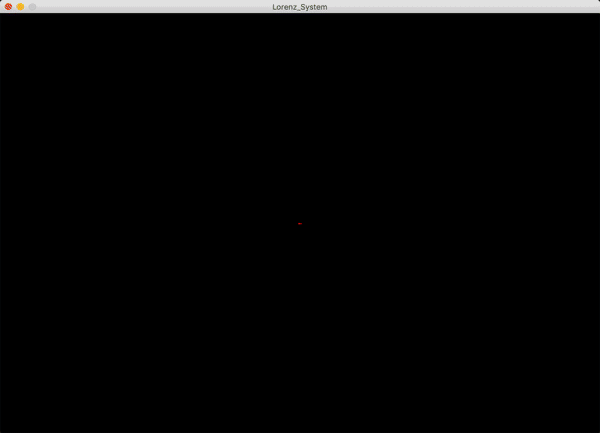
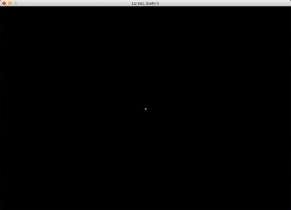
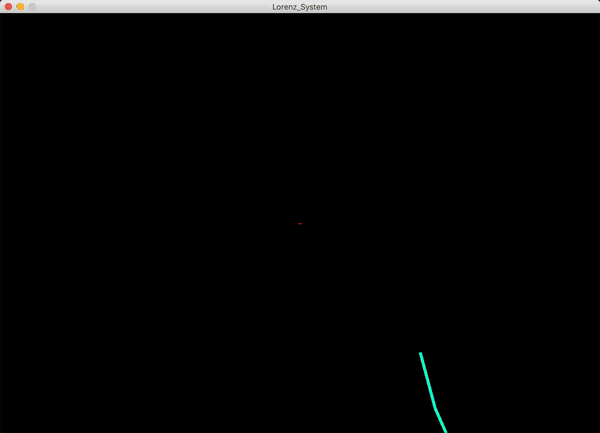

# lorenz-attractor

This project is written using Processing and the PeasyCam Library.

The program simulates the Lorenz Attractor by using Lorenz's differential equations. 
The objective of this project is to present of visual representation of two of the Lorenz Equation and the Chao Theory's traits -- 
sensitivity to initial conditions & strange attractors. The user can also use personalized equations by modifying the constants and time stamps(dt).

#### The Lorenz Equation
dx/dt = σ * (y - x);  
dy/dt = x * (ρ - z) - y;  
dz/dt = x * y - β * z;  
The Lorenz Attractor is formed when  
σ = 10, 
ρ = 28, 
β = 8/3

Although The Lorenz Equation is a Deterministic Dynamic System, it is highly sensitive to the initial conditions, 
thus making the long-term outcome unpredicatble. However, the shapes of the solutions are similar no matter the initial conditions,
hence the name attractor.

#### GIFs
##### The Lorenz Attractor

##### Slight change to the initial conditions

##### Extreme change to the initial conditions

